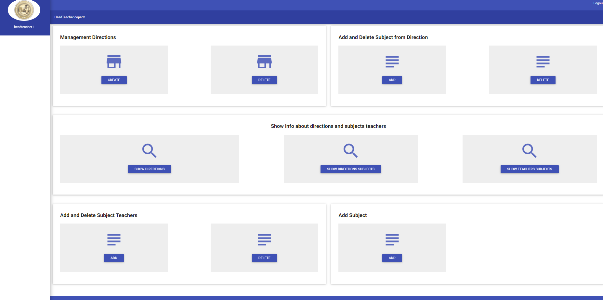

# University-Personnel-Department

There are 4 users (an employee of the personnel department, head of the department, dean, teacher).
The head of the department can add, delete and change directions, disciplines for directions and disciplines for teachers.
The dean can create, delete and change departments, groups.
The teacher can watch the disciplines he teaches.
An HR employee hires and removes employees.

